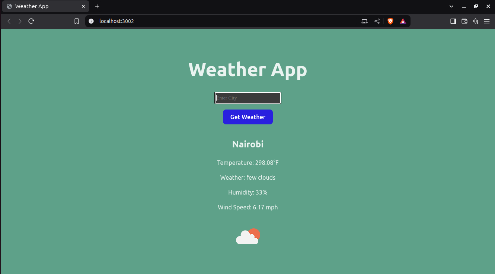

# Weather App

An app that uses the OpenWeather API to fetch weather data for a city and displays it.

## Basic Features

1. Search Bar: Users can enter a city name.
2. API Integration: Fetch weather data from an API like OpenWeatherMap.
3. Display Data: Show city name, temperature, weather condition, humidity, and wind speed.

